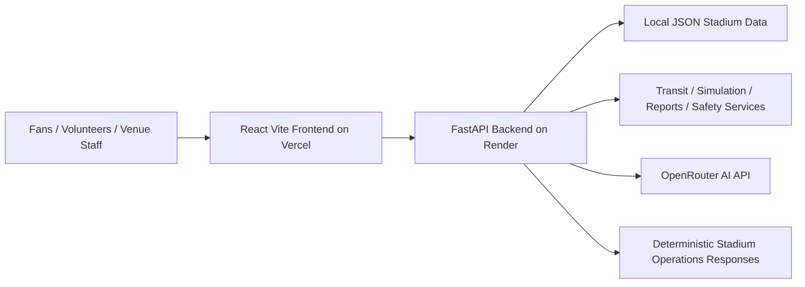

# NexaStadium AI

GenAI-powered FIFA World Cup 2026 stadium operations and fan experience platform.

NexaStadium AI helps fans, volunteers, venue staff, and operations teams make safer, clearer, and faster match-day decisions. The platform combines a React fan/ops/transit interface with a FastAPI backend, local FIFA World Cup 2026 venue data, deterministic stadium operations logic, and backend-only OpenRouter AI responses.

## What It Solves

Large tournament venues need calm communication, accessible routing, crowd-flow planning, multilingual fan guidance, and staff-ready operational intelligence. NexaStadium AI turns those needs into usable workflows:

| Domain | Product Capability |
| --- | --- |
| Fan support | Stadium AI assistant, safety guide, trip planner, and accessibility guidance |
| Stadium navigation | Step-by-step wayfinding with accessibility-aware route notes |
| Operations intelligence | Incident action plans, PA announcements, match-day briefings, and reports |
| Crowd management | Scenario engine, risk simulator, and scenario comparison |
| Transit and egress | Egress planner, route recommender, transport alerts, and flow-control planner |
| Sustainability | Venue carbon, waste, refill, transit, and energy dashboard |
| Multilingual access | English, Spanish, French, Arabic, Portuguese, and German UI support with Arabic RTL |

## Highlights

- No-auth public demo architecture: Fan, Ops, and Transit portals are open by design.
- Backend-only OpenRouter integration: no AI key is exposed to the browser.
- Local JSON venue intelligence for all 16 FIFA World Cup 2026 host stadiums.
- Deterministic fallback responses keep the demo useful when the free AI tier is unavailable.
- No external database requirement.
- Prompt guard, rate limiting, CORS settings, human-readable API errors, and no raw provider errors.
- Accessible UI patterns: skip link, native language selector, visible labels, focus rings, semantic lists/tables, and RTL support.

## Live Product Routes

### Fan Portal

- `/`
- `/fan` redirects to `/`
- `/fan/assistant`
- `/fan/navigator`
- `/fan/trip-planner`
- `/fan/accessibility`
- `/fan/safety-guide`

### Operations Portal

- `/ops`
- `/ops/incidents`
- `/ops/announcements`
- `/ops/sustainability`
- `/ops/simulator`
- `/ops/briefing`
- `/ops/reports`

### Transit Portal

- `/transit`
- `/transit/egress`
- `/transit/routes`
- `/transit/alerts`
- `/transit/flow-control`

## Architecture

```text
nexastadium/
  client/    React 18 + Vite + Tailwind frontend
  server/    FastAPI + Pydantic backend
  SOLUTION_MAP.md
  README.md
```



The frontend never calls OpenRouter directly. The backend owns provider credentials, local JSON powers deterministic workflows, and fallback responses keep stadium operations guidance available when a model is unavailable or rate-limited.

### Frontend

- React 18 with Vite
- React Router v6
- Tailwind CSS
- Axios service wrappers
- react-i18next with lazy-loaded locale files
- PropTypes and accessible reusable components

### Backend

- Python target runtime: 3.11
- FastAPI
- Pydantic v2 and pydantic-settings
- SlowAPI rate limiting
- httpx for backend-only OpenRouter calls
- Local JSON data services for stadiums, scenarios, playbooks, safety templates, and knowledge entries
- Pytest test suite with no external network dependency

## AI And Data Boundaries

NexaStadium AI uses OpenRouter only from the FastAPI backend. The frontend never calls OpenRouter directly and never receives the API key.

Default model:

```bash
OPENROUTER_MODEL=poolside/laguna-xs-2.1:free
```

If the OpenRouter key is missing, the free tier is rate-limited, or a model returns invalid structured output, the backend returns polished deterministic FIFA World Cup 2026 stadium guidance. User-facing responses do not show provider errors, fallback wording, or raw exceptions.

NexaStadium AI uses local JSON data and deterministic backend services. No external database requirement.

## Environment Variables

Backend variables are documented in `server/.env.example`:

```bash
OPENROUTER_API_KEY=
OPENROUTER_MODEL=poolside/laguna-xs-2.1:free
OPENROUTER_BASE_URL=https://openrouter.ai/api/v1
OPENROUTER_SITE_URL=http://localhost:5173
OPENROUTER_APP_NAME=NexaStadium AI
ALLOWED_ORIGINS=["http://localhost:5173","http://127.0.0.1:5173","http://localhost:3000","http://127.0.0.1:3000"]
ENVIRONMENT=development
RATE_LIMIT_PER_MINUTE=30
```

Frontend variables are documented in `client/.env.example`:

```bash
VITE_API_BASE_URL=
```

Do not commit local `.env` files.

## Run Locally

### Backend

```powershell
cd server
python -m venv .venv
.\.venv\Scripts\pip install -r requirements.txt
.\.venv\Scripts\uvicorn app.main:app --reload
```

Health check:

```powershell
curl http://localhost:8000/health
```

### Frontend

```powershell
cd client
npm install
npm run dev
```

The frontend defaults to `http://localhost:8000` when `VITE_API_BASE_URL` is empty.

## API Surface

| Area | Endpoints |
| --- | --- |
| Health | `GET /health` |
| AI | `POST /api/ai/fan-assistant`, `POST /api/ai/navigation-guidance`, `POST /api/ai/ops-recommendation`, `POST /api/ai/pa-announcement`, `POST /api/ai/match-day-briefing`, `POST /api/ai/safety-support-pack` |
| Stadiums | `GET /api/stadium/list`, `GET /api/stadium/{stadium_id}`, `GET /api/stadium/scenarios`, `GET /api/stadium/scenarios/list` |
| Transit | `GET /api/transit/options/{stadium_id}`, `POST /api/transit/egress-plan`, `POST /api/transit/route-recommendation`, `GET /api/transit/alerts/{stadium_id}` |
| Knowledge | `GET /api/knowledge/search` |
| Simulation | `POST /api/simulation/crowd-risk`, `POST /api/simulation/scenario-compare`, `POST /api/simulation/flow-control` |
| Reports | `POST /api/reports/operations-summary` |

## Testing And Build

Backend tests:

```powershell
cd server
python -m venv .venv
.\.venv\Scripts\pip install -r requirements.txt
.\.venv\Scripts\pytest
```

Frontend build:

```powershell
cd client
npm install
npm run test:smoke
npm run build
```

The backend tests cover prompt sanitization, AI response contracts, invalid JSON fallback behavior, scenario engine, knowledge service, transit service, simulation service, report service, deployment safety, and removed external database setup.

## Quality Gates

- Backend tests run with `pytest` and do not require OpenRouter, Vercel, Render, external transit APIs, or a database.
- Frontend smoke checks verify Vercel SPA routing, core React routes, OpenRouter frontend isolation, removed evaluation-only routes, and accessibility basics.
- Frontend production build runs with Vite through `npm run build`.
- GitHub Actions runs backend tests and frontend smoke/build checks on pushes and pull requests to `main`.
- Dependabot monitors npm, pip, and GitHub Actions dependencies weekly.
- Accessibility evidence includes skip navigation, native language selection, Arabic RTL handling, visible focus styles, labelled controls, and status semantics.
- Deployment evidence includes `client/vercel.json` for React Router rewrites and `server/.python-version` for Render-compatible Python runtime pinning.

## Deployment

### Frontend on Vercel

- Root directory: `client`
- Install command: `npm install`
- Build command: `npm run build`
- Output directory: `dist`
- Required env var: `VITE_API_BASE_URL=https://your-backend-live-url`

Do not add `OPENROUTER_API_KEY` to Vercel frontend environment variables.

### Backend on Render or Railway

- Root directory: `server`
- Start command: `uvicorn app.main:app --host 0.0.0.0 --port $PORT`
- Health check: `GET /health`
- Python runtime: `server/.python-version` pins `3.11.11`; set `PYTHON_VERSION=3.11.11` in Render as an additional platform guard.
- Required env vars: `OPENROUTER_API_KEY`, `OPENROUTER_MODEL`, `OPENROUTER_BASE_URL`, `OPENROUTER_SITE_URL`, `OPENROUTER_APP_NAME`, `ALLOWED_ORIGINS`, `ENVIRONMENT`, `RATE_LIMIT_PER_MINUTE`, `PYTHON_VERSION`

Set `ALLOWED_ORIGINS` to include the deployed Vercel domain.

## Security And Quality Notes

- No login, JWT, role guards, protected routes, or token storage.
- No external database requirement.
- No real transit API integration in this prototype.
- No OpenRouter key in frontend code, localStorage, or Vercel frontend env vars.
- Prompt inputs are sanitized, truncated, and guarded before AI calls.
- AI request logs record request type only, not user prompt content.
- Generated folders, build output, virtual environments, caches, logs, and local `.env` files are ignored.

## Repository Map

Use `SOLUTION_MAP.md` to see how every product domain maps to the implementation files for architecture review and maintenance.

## Known Limitations

- Local JSON data is designed for a deterministic hackathon demo and is not a live venue operations feed.
- OpenRouter free-tier model availability and rate limits can change.
- External transit integrations are prepared for future phases but intentionally unused in the current build.

## Submission Cleanup

Before pushing or uploading, remove generated artifacts while preserving source and local `.env` files:

```powershell
Remove-Item -Recurse -Force client\node_modules, client\dist, server\.venv -ErrorAction SilentlyContinue
Get-ChildItem -Recurse -Force -Directory -Include __pycache__, .pytest_cache | Remove-Item -Recurse -Force
```

Local `server/.env` and `client/.env` files must stay ignored and must not be committed.
